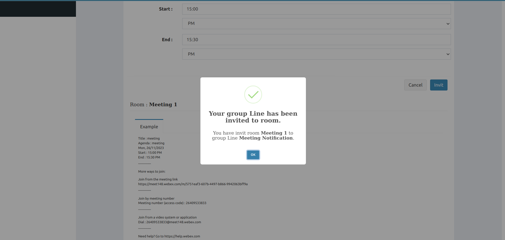

# notificationmeetings-reactjs-nodejs-gmail-line-ciscowebex-docker

- เป็นระบบ Notification Meetings ที่สามารถแจ้งเตือนการประชุมผ่าน Gmail และ Line  ที่พัฒนาด้วย ReactJS เป็น frontend และใช้ NodeJS เป็น Webservice API โดยใช้ framework ที่ชื่อว่า Express 
- โดยระบบสร้างห้องประชุมผ่าน Web Conference ชื่อ Cisco Webex Meetings
- ใช้ฐานข้อมูล SQLite 
- โดยระบบทั้งหมด Deploy บน Virtualization Technology คือ Docker
- ประโยชน์ของระบบนี้ คือ ช่วยในการจัดการเรื่องของการประชุมให้อยู่ในระบบ เดียวกัน ทำให้การสร้างห้องประชุมสะดวกยิ่งขึ้น

## Tech Stack in Project 

- **Language**
    - JavaScript(ReactJS)
    - JavaScript(NodeJS)
- **State Management**
    - React Redux
    - Redux Logger
    - Redux Thunk
- **Framework**
    - Bootstrap v3.3.7 
    - Template AdminLTE v2.4.0
- **Virtualization Technology**
    - Docker
- **Database**
    - SQLite
- **Object Relational Mapping**
    - Sequelize

## Get Started
1. install Docker
- [Installation Docker](https://docs.docker.com/engine/install/)

2. install project with Shell script for Linux

```bash
  cd notificationmeetings-reactjs-nodejs-gmail-line-ciscowebex-docker
  cd sh
  su
  Password: <password admin>
  ./install.sh 
```

## Screenshots

ตัวอย่าง : หน้า Login เข้าสู่ระบบ

ค้นหา Token [webex](https://developer.webex.com/docs/getting-started)


ตัวอย่าง : หน้า Dashboard


ตัวอย่าง : หน้าแบบ Form ให้กรอกเพื่อสร้าง Link เข้าประชุมโดยผ่าน Gmail 


ตัวอย่าง : หน้าแจ้งเตือนเข้าประชุม บนกล่องข้อความ Gmail


ตัวอย่าง : หน้าสร้าง Link เข้าประชุมโดยผ่าน Line




ตัวอย่าง : หน้าแจ้งเตือนเข้าประชุม ในช่องแชท Line


## Used By
[](https://github.com/TopThiraphat)

## Support Me
[](https://ko-fi.com/R5R0RDJVK)


